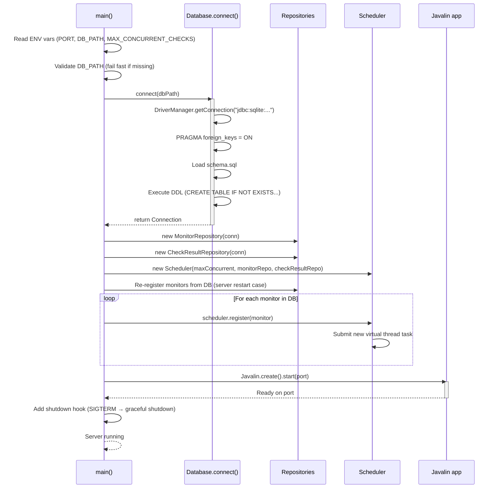
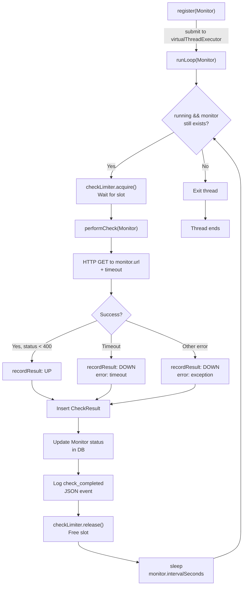
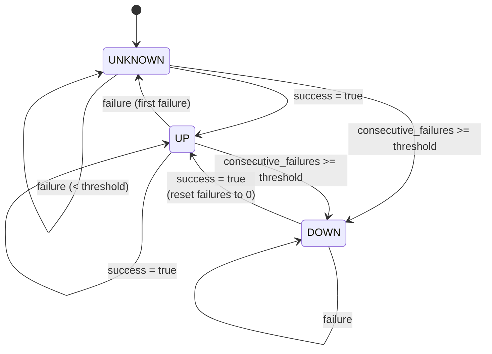
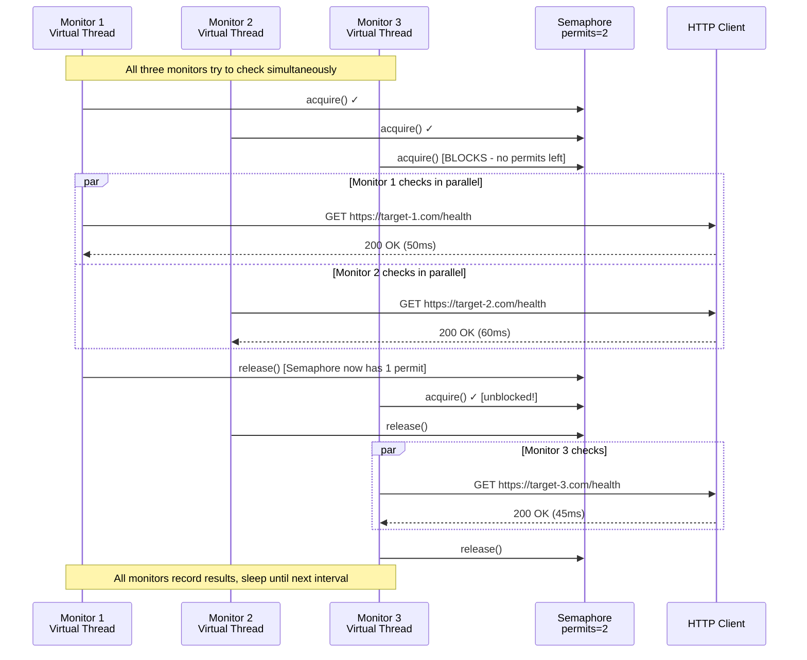
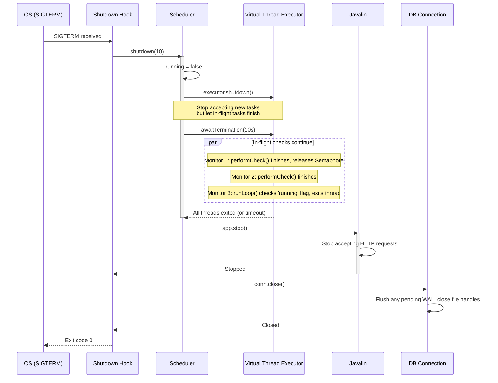
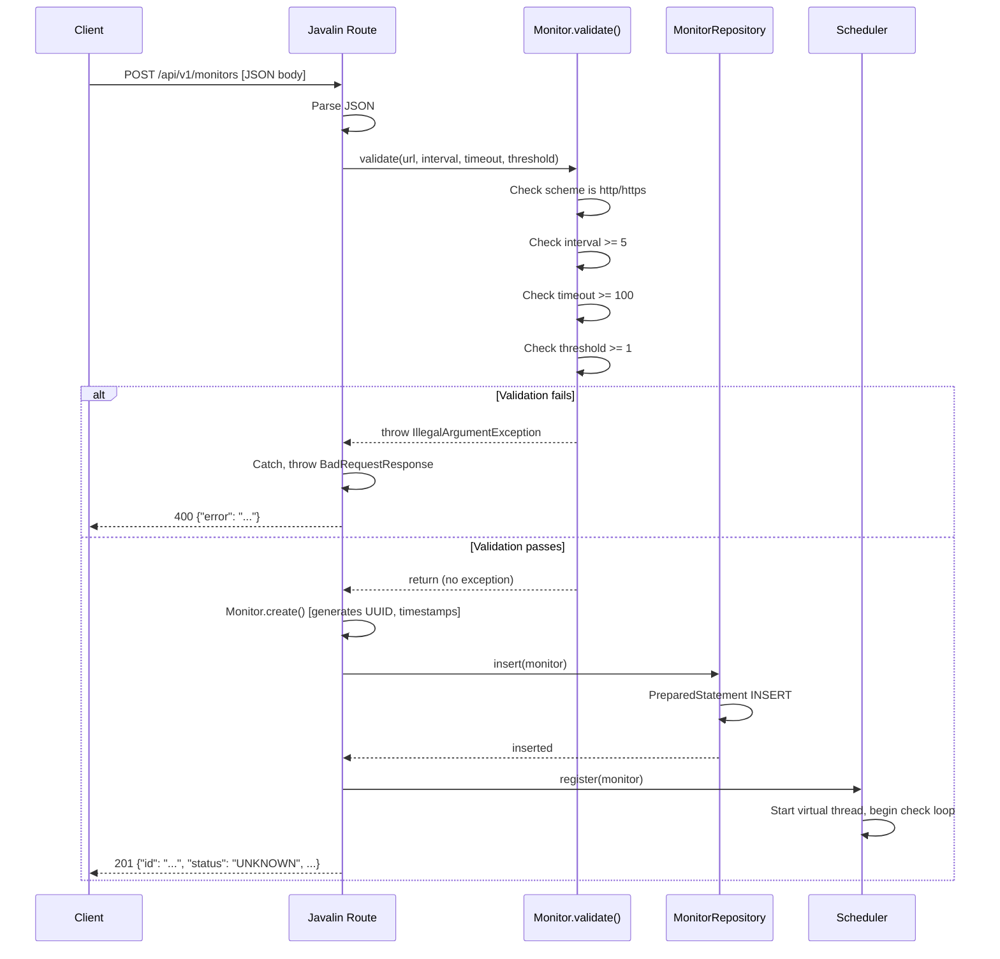
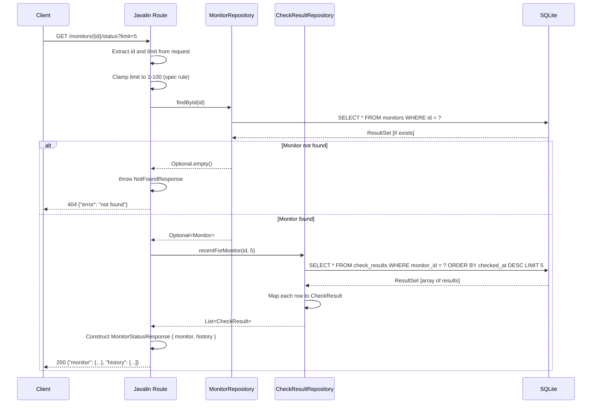

# Java Implementation: Polyglot Health Monitor

## Overview

The Java implementation uses **Javalin** for HTTP routing and **virtual threads** (Java 21+) for concurrent monitor scheduling. This design emphasizes **idiomatic Java concurrency patterns** rather than high-level frameworks that would abstract away the control we're practicing.

### Key Technology Choices

| Component | Choice | Why Not the Alternative |
|-----------|--------|------------------------|
| **HTTP Framework** | Javalin (thin wrapper) | Not Spring Boot — Spring's `@Async`/`@Scheduled` would do concurrency *for us*, hiding the idiom |
| **Concurrency** | Virtual threads + Semaphore | Thread-per-task is explicit and visible; old platform threads would be too expensive at scale |
| **Database** | Raw JDBC + sqlite-jdbc | Not Hibernate/JPA — we want raw `PreparedStatement` and cursor mapping visible, not auto-generated SQL |

---

## Architecture

### Layered Design

```
┌─────────────────────────────────────────┐
│         Javalin HTTP Layer              │
│  (Routes: /healthz, /monitors, /status) │
└─────────────────────────────────────────┘
                    ↓
┌─────────────────────────────────────────┐
│   Repository Pattern (DAO)              │
│  • MonitorRepository (CRUD)             │
│  • CheckResultRepository (log queries)  │
└─────────────────────────────────────────┘
                    ↓
┌─────────────────────────────────────────┐
│   Model Layer                           │
│  • Monitor (domain object + rules)      │
│  • CheckResult (immutable result)       │
└─────────────────────────────────────────┘
                    ↓
┌─────────────────────────────────────────┐
│   SQLite Database (schema.sql)          │
│  • Shared across all 4 implementations  │
└─────────────────────────────────────────┘

┌─────────────────────────────────────────┐
│   Scheduler (Independent)               │
│  • Virtual thread pool                  │
│  • Per-monitor event loop               │
│  • Semaphore-bounded concurrency        │
└─────────────────────────────────────────┘
```

---

## Why Database Connection Runs at Startup

### Fail-Fast Principle

```java
String dbPath = System.getenv("DB_PATH");
if (dbPath == null || dbPath.isBlank()) {
    System.err.println("FATAL: DB_PATH environment variable is required");
    System.exit(1);
}
Connection conn = Database.connect(dbPath);
```

**Rationale:**

1. **Configuration Validation** — If `DB_PATH` is missing or the database is inaccessible, we fail immediately with a clear error, not silently after partial initialization.
2. **Schema Idempotency** — `Database.connect()` applies `schema.sql` on startup if tables don't exist, ensuring all four implementations start with the same schema state.
3. **Single Connection Lifetime** — A long-lived `Connection` is obtained once and reused for all repository queries, avoiding repeated connection overhead and ensuring transaction consistency.
4. **Explicit Control** — Unlike ORMs with connection pools and lazy initialization, we open the connection explicitly, making the startup cost visible and testable.

### Connection Reuse Pattern

```java
Connection conn = Database.connect(dbPath);
MonitorRepository monitorRepo = new MonitorRepository(conn);
CheckResultRepository checkResultRepo = new CheckResultRepository(conn);
Scheduler scheduler = new Scheduler(maxConcurrent, monitorRepo, checkResultRepo);
```

The repositories share the same `Connection` instance, so:

- All database operations use a single JDBC connection (appropriate for SQLite, which is file-based and thread-safe with `PRAGMA foreign_keys = ON`).
- PreparedStatements are created on-demand per query, not pooled.
- Transactions are implicit (autocommit mode) per SQL standard.

---

## Startup Flow



---

## Monitor Lifecycle & Scheduler Flow

### Per-Monitor Virtual Thread Loop



### Check Result State Machine

The `Monitor.recordResult(boolean success)` method implements Section 4 status-transition rules:



**Key Rules:**

1. On success → reset `consecutiveFailures` to 0, set status to `UP`.
2. On failure → increment `consecutiveFailures`; if >= `failureThreshold`, set status to `DOWN`.
3. Status is persisted after every check via `MonitorRepository.updateStatus()`.

---

## Concurrency Model

### Virtual Thread per Monitor

Java 21 virtual threads allow one thread per monitor **without resource exhaustion**:

```java
private final ExecutorService virtualThreadExecutor =
        Executors.newVirtualThreadPerTaskExecutor();

public void register(Monitor monitor) {
    monitors.put(monitor.id, monitor);
    virtualThreadExecutor.submit(() -> runLoop(monitor));
}
```

**Benefit:** Unlike old platform threads (1 OS thread per task), virtual threads are lightweight and managed by Project Loom's scheduler, allowing thousands of concurrent loops.

### Semaphore Bounds Concurrent Checks

```java
private final Semaphore checkLimiter;

public Scheduler(int maxConcurrentChecks, ...) {
    this.checkLimiter = new Semaphore(maxConcurrentChecks);
}

private void runLoop(Monitor monitor) {
    while (running && monitors.containsKey(monitor.id)) {
        try {
            checkLimiter.acquire(); // Block until slot available
            try {
                performCheck(monitor);
            } finally {
                checkLimiter.release(); // Always release, even on exception
            }
            Thread.sleep(Duration.ofSeconds(monitor.intervalSeconds));
        } catch (InterruptedException e) {
            Thread.currentThread().interrupt();
            return;
        }
    }
}
```

**Why?** Without the `Semaphore`, all 1000 monitors might issue HTTP requests simultaneously, overwhelming the target host and exhausting local connection limits. The semaphore ensures at most `MAX_CONCURRENT_CHECKS` (default 10) are in-flight at any time.

### Concurrent Execution Flow



---

## HTTP Request Timeout Handling

```java
private void performCheck(Monitor monitor) {
    CheckResult result;
    try {
        HttpRequest request = HttpRequest.newBuilder()
                .uri(URI.create(monitor.url))
                .timeout(Duration.ofMillis(monitor.timeoutMs))  // Transport-level timeout
                .GET()
                .build();

        long start = System.currentTimeMillis();
        HttpResponse<Void> response = httpClient.send(request, HttpResponse.BodyHandlers.discarding());
        long latency = System.currentTimeMillis() - start;

        boolean success = response.statusCode() < 400;
        result = CheckResult.success(monitor.id, response.statusCode(), (int) latency);
        monitor.recordResult(success);
    } catch (java.net.http.HttpTimeoutException e) {
        // Timeout at transport level — not a client-side wait timeout
        result = CheckResult.failure(monitor.id, "timeout");
        monitor.recordResult(false);
    } catch (Exception e) {
        result = CheckResult.failure(monitor.id, e.getClass().getSimpleName() + ": " + e.getMessage());
        monitor.recordResult(false);
    }

    checkResultRepo.insert(result);
    monitorRepo.updateStatus(monitor.id, monitor.status, monitor.consecutiveFailures);
}
```

**Key Detail:** The timeout is set at the `HttpRequest` level via `.timeout(Duration)`, so it cancels the in-flight request at the HTTP transport layer, not just a client-side wait. This ensures the target server doesn't receive a half-closed connection.

---

## Graceful Shutdown

```java
Runtime.getRuntime().addShutdownHook(new Thread(() -> {
    scheduler.shutdown(10); // 10-second grace period
    app.stop();
    try {
        conn.close();
    } catch (Exception ignored) {}
}));
```

### Shutdown Sequence



**Grace Period Behavior:**

- `running = false` stops each virtual thread from starting a new `performCheck()`.
- `executor.shutdown()` prevents new tasks from being submitted.
- `awaitTermination(10, TimeUnit.SECONDS)` waits up to 10 seconds for all in-flight checks to finish.
- If any thread exceeds 10 seconds, `shutdownNow()` sends `InterruptedException` to force exit.
- Finally, the database connection is closed cleanly.

---

## Request Handling Examples

### Example 1: Create Monitor

**Request:**

```json
POST /api/v1/monitors
Content-Type: application/json

{
  "name": "example-api",
  "url": "https://example.com/health",
  "interval_seconds": 30,
  "timeout_ms": 2000,
  "failure_threshold": 3
}
```

**Flow:**



### Example 2: Get Monitor Status with History

**Request:**

```
GET /api/v1/monitors/{id}/status?limit=5
```

**Flow:**



---

## Database Schema Integration

### Connection Initialization

```java
public static Connection connect(String dbPath) {
    Connection conn = DriverManager.getConnection("jdbc:sqlite:" + dbPath);
    try (Statement stmt = conn.createStatement()) {
        stmt.execute("PRAGMA foreign_keys = ON;");  // Enable cascading deletes
    }
    applySchema(conn);
    return conn;
}
```

### Schema Application

```java
private static void applySchema(Connection conn) throws SQLException {
    String schema = loadSchemaSql();  // Loaded from src/main/resources/schema.sql
    try (Statement stmt = conn.createStatement()) {
        for (String sql : schema.split(";")) {
            String trimmed = sql.trim();
            if (!trimmed.isEmpty()) {
                stmt.execute(trimmed);  // Idempotent: CREATE TABLE IF NOT EXISTS
            }
        }
    }
}
```

**Schema Highlights:**

- `PRAGMA foreign_keys = ON` ensures `DELETE FROM monitors` cascades to `check_results`.
- `CREATE TABLE IF NOT EXISTS` makes schema application idempotent (safe to re-run).
- Shared across all four implementations (Java, Go, Python, TypeScript).

---

## Structured Logging

```java
System.out.printf(
    "{\"level\":\"info\",\"event\":\"check_completed\",\"monitor_id\":\"%s\",\"success\":%b,\"status\":\"%s\",\"error\":%s,\"ts\":\"%s\"}%n",
    monitor.id, result.success, monitor.status,
    result.error == null ? "null" : "\"" + result.error + "\"",
    result.checkedAt
);
```

**Output Example:**

```json
{"level":"info","event":"check_completed","monitor_id":"550e8400-e29b-41d4-a716-446655440000","success":true,"status":"UP","error":null,"ts":"2024-01-15T10:30:45.123456Z"}
```

**Production Recommendation:** Swap `System.out.printf` for `org.slf4j.Logger` + logback JSON encoder for production deployments, which handles filtering, rotation, and structured batching.

---

## Key Design Decisions

| Decision                         | Rationale                                                                                         |
|:---------------------------------|:--------------------------------------------------------------------------------------------------|
| **Virtual threads**              | Lightweight, built into Java 21+; enables 1 thread per monitor without resource exhaustion        |
| **Semaphore**                    | Simple, explicit concurrency bound; avoids connection/resource exhaustion at target hosts         |
| **No ORM**                       | Raw JDBC `PreparedStatement` idiom is visible and testable; no magic SQL generation               |
| **Single long-lived connection** | Appropriate for SQLite (file-based, thread-safe); avoids pool overhead and initialization latency |
| **Fail-fast on startup**         | DB_PATH validation happens before any background threads start; clearer error messages            |
| **Graceful shutdown hook**       | SIGTERM gives in-flight checks a grace period to finish; prevents dirty DB exits                  |
| **Structured JSON logging**      | Machine-parseable events for monitoring and debugging; standardized across all 4 implementations  |

---

## Testing Strategy

### Unit Tests (No I/O)
- `Monitor.validate()` — reject each invalid field individually
- `Monitor.recordResult()` — verify status transition rules (UNKNOWN → DOWN after N failures, etc.)

### Integration Tests
1. **Status Transitions** — Create a monitor, point it at a test server that fails N times, verify status transitions to DOWN after `failureThreshold`, then succeeds and flips back to UP.
2. **Timeouts** — Point monitor at a server that sleeps > `timeout_ms`, verify `CheckResult.error = "timeout"` is recorded.
3. **Concurrency** — Register 50 monitors with `MAX_CONCURRENT_CHECKS=10`, verify no more than 10 concurrent outbound requests are in-flight.
4. **Cascading Delete** — Delete a monitor, verify its `check_results` rows are deleted too (FK cascade).

### Running Tests
```bash
cd java
mvn test
```

---

## File Structure

```
java/
├── pom.xml                                    # Maven config, dependencies
├── src/main/
│   ├── java/com/nitin/monitor/
│   │   ├── Main.java                         # Startup, Javalin routes, shutdown hook
│   │   ├── Database.java                     # Connection pool, schema init
│   │   ├── Monitor.java                      # Domain model, validation, status rules
│   │   ├── MonitorRepository.java            # CRUD queries
│   │   ├── CheckResult.java                  # Immutable result record
│   │   ├── CheckResultRepository.java        # Query check history
│   │   └── Scheduler.java                    # Virtual thread loop, Semaphore, HTTP checks
│   └── resources/
│       └── schema.sql                        # Copied from root schema.sql
├── src/test/
│   └── java/com/nitin/monitor/               # Unit + integration tests
└── target/                                   # Build output (compiled classes, JAR)
```

---

## Running the Server

### Prerequisites
- Java 21+
- Maven 3.9+

### Build & Run

```bash
cd java

# Compile
mvn compile

# Run with default port 8080 and MAX_CONCURRENT_CHECKS=10
DB_PATH="./monitor.db" mvn exec:java -Dexec.mainClass=com.nitin.monitor.Main

# Or with custom settings
PORT=9000 MAX_CONCURRENT_CHECKS=5 DB_PATH="/tmp/monitor.db" mvn exec:java \
  -Dexec.mainClass=com.nitin.monitor.Main
```

### Quick Test
```bash
curl http://localhost:8080/api/v1/healthz
# {"status":"ok"}

curl -X POST http://localhost:8080/api/v1/monitors \
  -H "Content-Type: application/json" \
  -d '{
    "name": "github-api",
    "url": "https://api.github.com",
    "interval_seconds": 30,
    "timeout_ms": 2000,
    "failure_threshold": 3
  }'
# {"id": "...", "status": "UNKNOWN", ...}
```

---

## Comparison with Other Languages

| Aspect          | Java                               | Go                             | Python                           | TypeScript              |
|:----------------|:-----------------------------------|:-------------------------------|:---------------------------------|:------------------------|
| **Concurrency** | Virtual threads + Semaphore        | Goroutines + channel           | asyncio.Task + asyncio.Semaphore | setInterval + p-limit   |
| **Timeout**     | `HttpRequest.timeout()`            | `context.WithTimeout()`        | `asyncio.wait_for()`             | `AbortSignal.timeout()` |
| **Database**    | Raw JDBC                           | `modernc.org/sqlite`           | `aiosqlite` (async)              | `better-sqlite3` (sync) |
| **Shutdown**    | Shutdown hook                      | signal.Notify + context.Cancel | asyncio.CancelledError handling  | SIGTERM event listeners |
| **Logging**     | `System.out` → (production: slf4j) | `log/slog`                     | `structlog`                      | `pino`                  |


